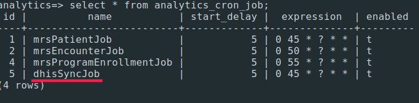
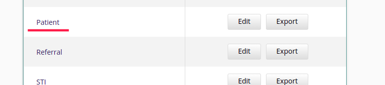
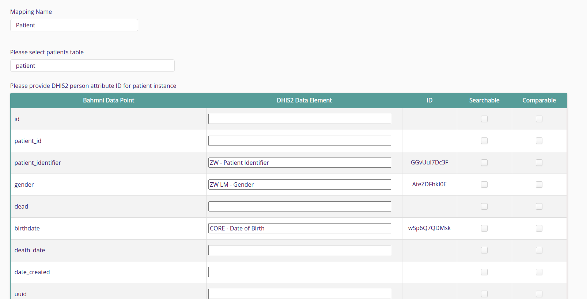

# mart-dhis2-sync

Spring Batch Application to sync data from Analytics DB to DHIS2


### Overview

We will be pushing the flattened data in form tables incrementally to DHIS2. The sync will be triggered automatically at
a predefined time as specified in the `analytics_cron_job` table.


All the forms we enter in an encounter will be grouped together into events based on the DHIS program stage they belong
to. For eg: If we enter the details of Provider HIV test Counselling, HIV Self Testing, NCD Template and IPV Form in a
single encounter, we will have three events. One for the HTS program stage, with data from Provider HIV test counselling
and HIV Self testing, and one each for NDC and IPV program stages, corresponding to the data from the respective forms.
Each of these events will be pushed independently to DHIS.

### Event Sync Flow

The details of events to be synced are stored in the `events_to_sync` table. When the sync is triggered at the specified
time, we will get all the events which needs to be synced from `events_to_sync` table, and will try to push them
one-by-one. For each event, we will check if a Tracked Entity for the corresponding patient exists in DHIS. If it
doesn't we will create a new one, otherwise we will use the existing one. Similarly, we will check if the patient is
enrolled to the ZW - New Start EMR program. If the patient is already enrolled we will take the existing enrolment ID,
otherwise we will create a new one. The enrollment date will be that of the oldest bahmni-program enrolment. We will use
these patient and enrolment ID's for syncing the events. The DHIS Ids for patients, program enrolments and events
will be stored in tracker tables in the analytics DB, namely `instance_tracker`, `enrolment_tracker` and `event_tracker`
tables.

In case there are any issues while syncing an event, we will log the error (which will be displayed in the frontend
on `Sync Logs` page) and then continue with the next event. We will try to push these skipped events again when the sync
job is triggered next time. If the errors mentioned in the logs are fixed, they will get synced.

## Events

Each event corresponds to a program stage in DHIS2, and will contain all the form data captured for that program stage
in an encounter. The data will be taken from the flattened form tables.

### Job Creation and triggering

## Program Flow

1. The JobScheduler triggers the syncToDhis method in SyncService.
2. In the sync method, we select all the events which need to be synced, i.e. havind `synced` = false in
   the `events_to_sync` table, and we will try to push them one by one.
3. The tracked entity for the patient in the event is created or updated.
4. The programDetails are synced by calling `programDataSyncService.syncProgramDetails(syncEvent, mappingJson)`.
5. If the push is successful we will mark `synced = true` for the event in `events_to_sync`, otherwise we will log the
   error.

## Batch Job Architecture

We will have two jobs, one for pushing TrackedEntity data and one for Enrolment and Event data. The jobs are built by
passing in the corresponding reader, processor and writer to TrackedEntityInstanceStep and ProgramDataSyncStep.

####Readers

The JdbcCursorItemReader for reading the data from flattened tables will be generated by the MappingReader using the
sqls specified. For reading the data from the tables and to map the columns to their corresponding data element in
DHIS2, we will be using the data entered in `mapping` table. The DHIS program stage id will be specified in
the `program_name` column of the mapping table, and the corresponding mapping json for a program are stored in the
`mapping_json` column.

The structure of the mapping will be as given below.

```json
{
  "isPatientMapping": false, // this will be true for patient mapping.
  "dhisProgramStageId": {   //DHIS program stage ID and name.
    "id": "kv6FYqNxzOd",
    "displayName": "PREP"
  },
  "formTableMappings": {
    "prep_screening_tool_8867": {  //Table for PrEP Screening Tool form
      "psf_date_tested": {   //Column name in the table.
        "id": "wG4Rs645xS0", //DHIS data element ID
        "displayName": "ZW PrEP Scr TRK - Date tested"   //DHIS data element name.
      },
      "psf_client_offered_prep": {
        "id": "JIUnlneENiY",
        "displayName": "ZW PrEP Scr TRK - Client offered PrEP?"
      }
    },
    "prep_init_form_template_8491": {  //Table for PrEP Init Form
      "pif_are_you_on_arvs": {
        "id": "pqwwszWAQV7",
        "displayName": "ZW PreP TRK - Are you on ARVs"
      }
    }
  }
}

```

The patient mapping will also be stored in the mapping table itself, which stores the mappings from the columns in patient table
to DHIS Tracked Entity Attributes.



####Processors

Processors create the request body we need to sync to DHIS. eg : `TrackedEntityInstanceProcessor`.

####Writers

Writers push the data to DHIS2 endpoints using `SyncRepository` and handle the responses from DHIS.
eg : `TrackedEntityInstanceWriter`

## Logs

All the exceptions we encounter during syncing will be inserted into the `log` table using LoggerService.
The `bahmni-dhis2-integration-service` reads this data and displays it in the `Sync Log` section in the Bahmni UI.

### Buliding the RPM

Run gradle task for building RPM:

````
gradle buildRpm -x test
````

The RPM will be generated in build/distributions
