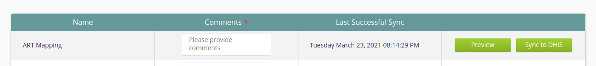

# mart-dhis2-sync

Spring Batch Application to sync data from Analytics DB to DHIS2

## Syncing data to Dhis2

Syncing starts when we click on the `Sync to Dhis` button from dhis-integration module in Bahmni.


This calls the `/pushData` endpoint in PushController. An example of the request body is provided below :

```
{"service":"ART Mapping","user":"superman","comment":"testComment"}
```

The LookUpTable, MappingJson and Config are fetched from the `mapping` table based on the service.

###Job Creation and triggering
####Steps
Job service is used for creating jobs with the stops we provide. There are different steps defined for each of the jobs
 we need to perform, for eg: `TrackedEntityInstanceStep` for syncing Patients.

####Processors
Processors create the api body we need to sync. eg : `TrackedEntityInstanceProcessor`.

####Writers
Writers push the data to DHIS2 endpoints using `SyncRepository` and handle the responses. eg : `TrackedEntityInstanceWriter`

###Syncing Instances, Enrollments and Events.
TrackedEntityInstances (Patients) are synced by invoking TEIService.triggerJob()